# 📖 Vanni AI — End-to-End Architecture & Sequence Workflow

This document provides a comprehensive, step-by-step technical breakdown of the complete **Vanni AI** application workflow. It details every operational layer—from user authentication and meeting orchestration to real-time voice streaming with Gemini Live, event-driven post-processing with Inngest, and interactive post-meeting context Q&A ("Ask AI").

---

## 📌 Table of Contents

- [1. Master Sequence Diagram](#1-master-sequence-diagram)
- [2. System Architecture & Components](#2-system-architecture--components)
- [3. Phase-by-Phase Technical Breakdown](#3-phase-by-phase-technical-breakdown)
  - [Phase 1: User Authentication \& Session Setup](#phase-1-user-authentication--session-setup)
  - [Phase 2: AI Agent Creation \& Persona Configuration](#phase-2-ai-agent-creation--persona-configuration)
  - [Phase 3: Meeting Creation \& Usage Verification](#phase-3-meeting-creation--usage-verification)
  - [Phase 4: User Joins Meeting](#phase-4-user-joins-meeting)
  - [Phase 5: Stream Webhook Trigger \& Worker Deployment](#phase-5-stream-webhook-trigger--worker-deployment)
  - [Phase 6: Railway Python Worker \& Gemini Live Initialization](#phase-6-railway-python-worker--gemini-live-initialization)
  - [Phase 7: Real-Time Multimodal Voice \& Audio Conversation](#phase-7-real-time-multimodal-voice--audio-conversation)
  - [Phase 8: Meeting Teardown \& Event Dispatching](#phase-8-meeting-teardown--event-dispatching)
  - [Phase 9: Asynchronous Post-Meeting AI Processing (Inngest Queue)](#phase-9-asynchronous-post-meeting-ai-processing-inngest-queue)
  - [Phase 10: Post-Meeting Review \& Interactive "Ask AI" Chat](#phase-10-post-meeting-review--interactive-ask-ai-chat)
- [4. Summary of Data Contracts \& Protocols](#4-summary-of-data-contracts--protocols)

---

## 1. Master Sequence Diagram

The master sequence diagram below illustrates the unified flow across all major subsystems in the Vanni AI ecosystem:

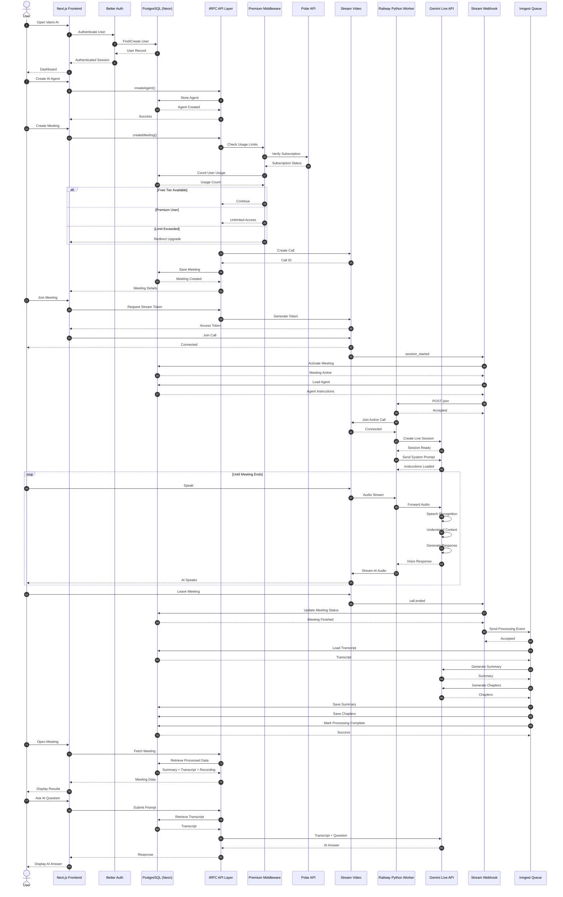

---

## 2. System Architecture & Components

| Component | Technology | Responsibility |
| :--- | :--- | :--- |
| **Next.js Frontend** | Next.js 15 (App Router), React, Tailwind CSS | UI rendering, client state, WebRTC video integration via Stream SDK, tRPC client invocation. |
| **Better Auth** | Better Auth Framework | Handles user authentication, session validation, OAuth providers, and secure HTTP-only cookies. |
| **PostgreSQL & Drizzle** | Neon Serverless PostgreSQL, Drizzle ORM | Primary database storing users, subscriptions, AI agents, meeting metadata, raw/processed transcripts, summaries, and chat sessions. |
| **tRPC API** | tRPC | End-to-end type-safe API endpoints for backend communications. |
| **Premium Middleware & Polar** | Polar.sh API | Manages tier verification, subscription state checks, and monthly meeting creation limits. |
| **Stream Video SDK** | Stream.io Video & Audio Cloud | Real-time WebRTC infrastructure for video calls, audio track management, and participant events. |
| **Railway Python Worker** | Python 3.11, FastAPI, Stream Python SDK | Background microservice deployed on Railway that connects to Stream calls as an autonomous audio bot. |
| **Gemini Live API** | Google Gemini 2.0 Multimodal WebSockets | Bidirectional real-time streaming audio API for speech recognition (STT), context understanding, and voice synthesis (TTS). |
| **Stream Webhook** | Next.js API Route (`/api/webhooks/stream`) | Handles asynchronous events from Stream (`session_started`, `call.ended`) to trigger worker deployment and job processing. |
| **Inngest Queue** | Inngest Event Queue | Serverless background queue managing post-meeting LLM jobs (summary generation, chapter extraction, indexing). |

---

## 3. Phase-by-Phase Technical Breakdown

### Phase 1: User Authentication & Session Setup

#### Sequence Diagram
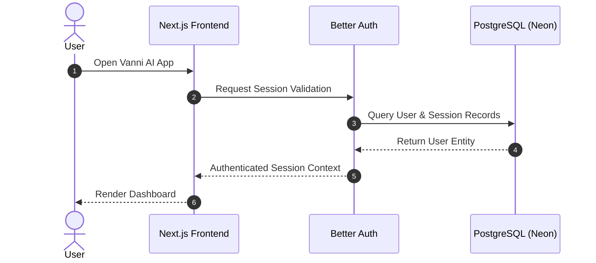

#### Technical Explanation
1. **User Initiation**: The user accesses the web application.
2. **Session Verification**: `Better Auth` intercepts the request, inspecting HTTP-only session cookies.
3. **Database Look-up**: If authenticating for the first time or refreshing, `Better Auth` queries PostgreSQL via Drizzle ORM to locate or register the user profile.
4. **Context Injection**: The verified session context (containing `userId`, `email`, and role permissions) is attached to the client React context, unlocking authenticated dashboard routes.

---

### Phase 2: AI Agent Creation & Persona Configuration

#### Sequence Diagram
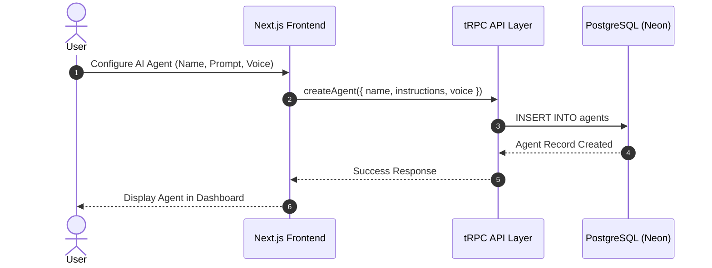

#### Technical Explanation
1. **Persona Definition**: Users customize their meeting bot by defining an **Agent Name**, **System Prompt** (instructions, personality, domain knowledge), and **Voice Profile** (e.g., Gemini voice selection like `Puck`, `Charon`, `Aoede`).
2. **tRPC Execution**: The frontend calls the `createAgent` procedure over tRPC.
3. **Persistence**: The server inserts the record into the PostgreSQL `agents` table linked to `userId`. The system prompt is stored to be retrieved dynamically when deploying the AI worker into a live meeting call.

---

### Phase 3: Meeting Creation & Usage Verification

#### Sequence Diagram
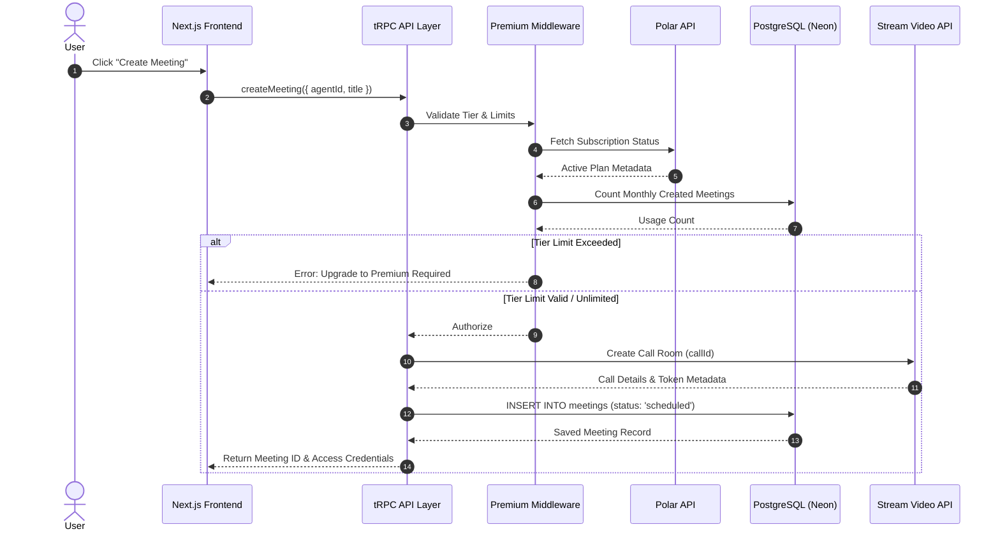

#### Technical Explanation
1. **Usage Check Middleware**: When `createMeeting()` is invoked, the `Premium` middleware verifies subscription entitlement via `Polar` and checks current usage counts in PostgreSQL.
2. **Stream Call Initialization**: Upon authorization, the server calls the Stream Video REST API to instantiate a call room with a unique `callId`.
3. **Database Pre-registration**: A meeting entry is saved in PostgreSQL with status `scheduled`, mapping the `callId`, `agentId`, and `userId`.

---

### Phase 4: User Joins Meeting

#### Sequence Diagram
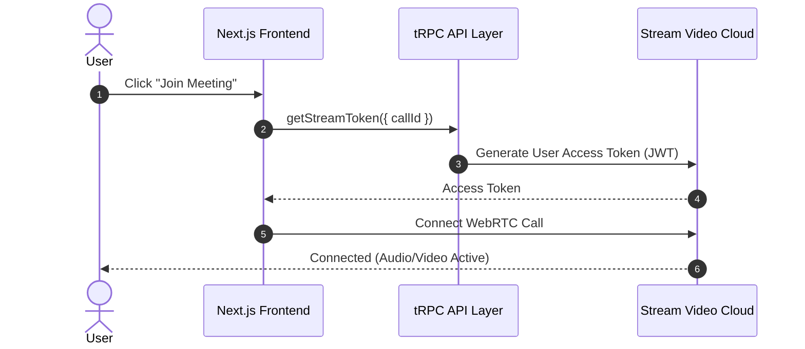

#### Technical Explanation
1. **Token Generation**: The frontend requests a Stream access token signed with the application secret.
2. **WebRTC Connection**: The client initializes the `@stream-io/video-react-sdk` client using the JWT token and joins the WebRTC media channel.

---

### Phase 5: Stream Webhook Trigger & Worker Deployment

#### Sequence Diagram
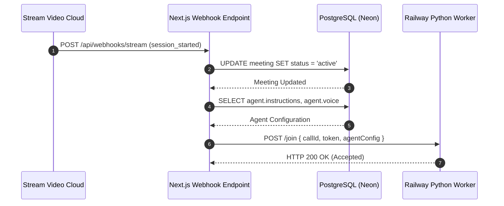

#### Technical Explanation
1. **Session Started Event**: As soon as human participants enter the Stream room, Stream dispatches a `session_started` webhook event to Next.js.
2. **State Activation**: The webhook handler updates meeting status to `active` in PostgreSQL and reads the configured AI agent system instructions.
3. **Dispatch to Python Worker**: Next.js sends an asynchronous HTTP `POST /join` request to the Railway Python microservice, passing call credentials and system prompts.

---

### Phase 6: Railway Python Worker & Gemini Live Initialization

#### Sequence Diagram
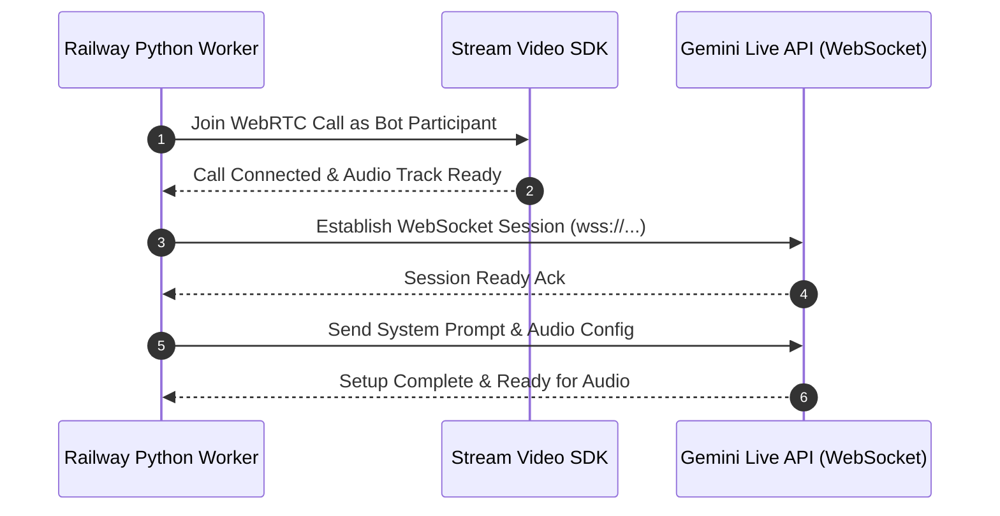

#### Technical Explanation
1. **Stream Bot Participant**: The Python worker instantiates a Stream Video Python client and joins the call room as an automated participant.
2. **Gemini Live Connection**: The worker opens a persistent WebSocket connection to Google's Gemini 2.0 Live API (`wss://generativelanguage.googleapis.com/...`).
3. **Handshake & Prompt Loading**: The worker transmits initial configuration frames containing output audio formats (PCM 16-bit 24kHz) and the agent's system prompt.

---

### Phase 7: Real-Time Multimodal Voice & Audio Conversation

#### Sequence Diagram
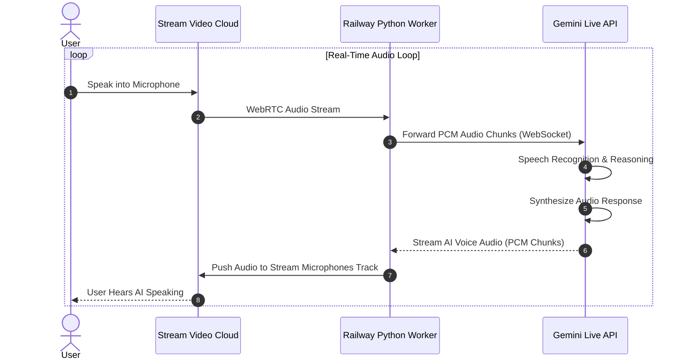

#### Technical Explanation
1. **Ingest & Forwarding**: As the user speaks, Stream routes low-latency PCM audio frames to the Python worker. The worker pushes raw audio frames over the WebSocket to Gemini.
2. **Gemini Real-Time Multimodal Processing**: Gemini performs real-time Speech-to-Text (STT), context inference, and voice synthesis (TTS) directly on the stream.
3. **Sub-second Voice Return**: Gemini streams back synthesized PCM audio chunks to the Python worker, which writes them directly to the Stream audio publisher track, allowing human participants to hear the AI speak with ultra-low latency.

---

### Phase 8: Meeting Teardown & Event Dispatching

#### Sequence Diagram
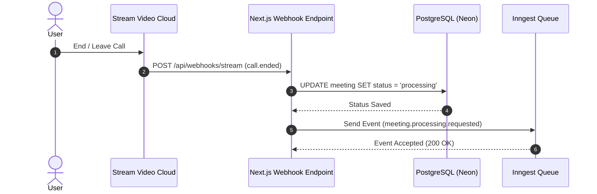

#### Technical Explanation
1. **Meeting Termination**: When participants leave, Stream emits a `call.ended` webhook containing call telemetry, recording location, and raw transcript logs.
2. **Queue Trigger**: The Next.js webhook sets the meeting status to `processing` in PostgreSQL and emits a `meeting.processing.requested` event to the **Inngest** background queue.

---

### Phase 9: Asynchronous Post-Meeting AI Processing (Inngest Queue)

#### Sequence Diagram
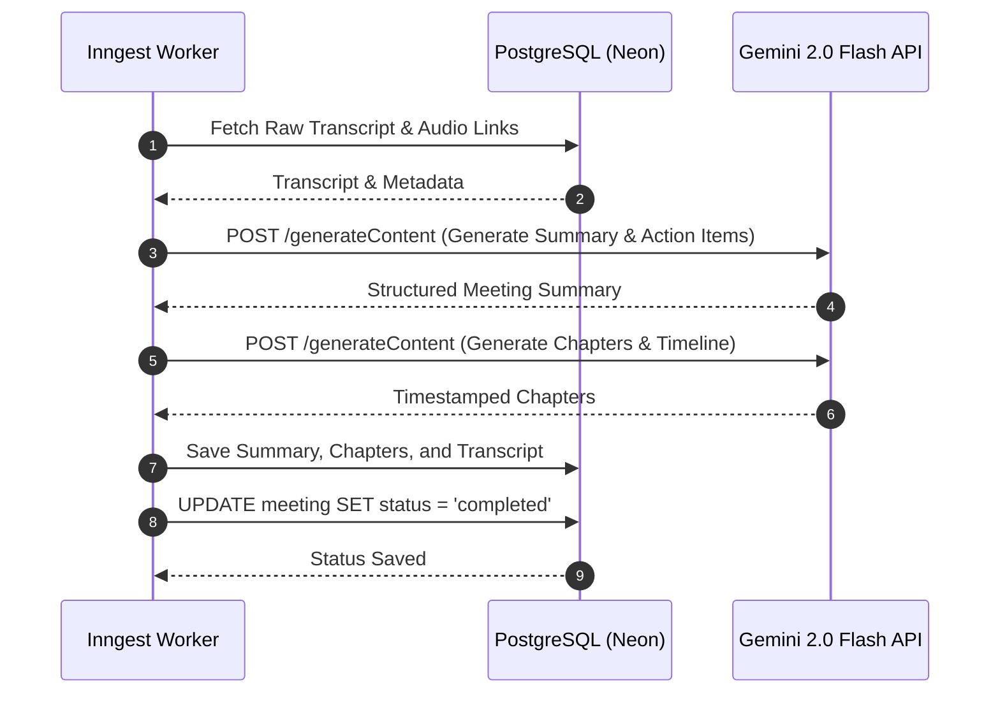

#### Technical Explanation
1. **Background Job Execution**: Inngest picks up the background event, executing isolated, fault-tolerant processing steps.
2. **Structured Summarization**: Inngest calls Gemini 2.0 Flash REST API to produce key takeaways, decisions, and action items.
3. **Chapter Extraction**: A separate step queries Gemini to parse timestamps and generate clickable meeting timeline chapters.
4. **Final Persistence**: Summary JSON, chapter arrays, and finalized transcripts are saved to PostgreSQL, marking the meeting status as `completed`.

---

### Phase 10: Post-Meeting Review & Interactive "Ask AI" Chat

#### Sequence Diagram
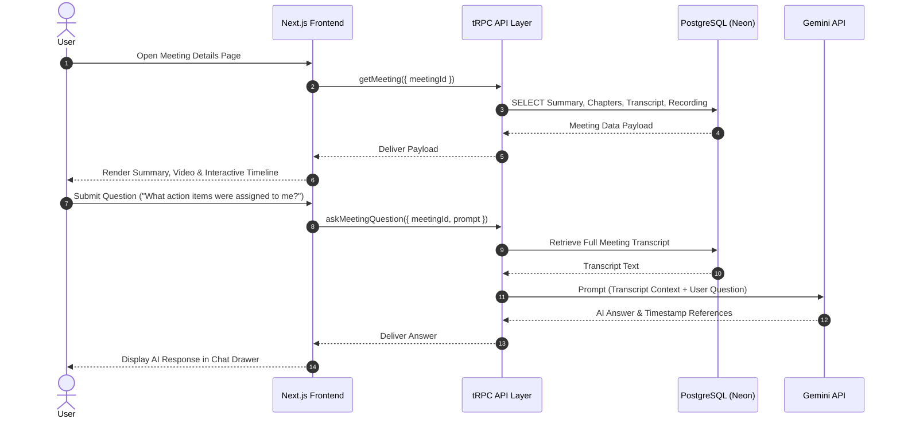

#### Technical Explanation
1. **Dashboard Rendering**: The user opens the completed meeting page. The frontend executes `getMeeting()` via tRPC to load the video recording URL, processed summary, interactive chapter list, and transcript.
2. **Context-Aware Q&A ("Ask AI")**:
   - The user asks follow-up questions about the meeting.
   - tRPC queries the stored meeting transcript from PostgreSQL.
   - The server injects the full transcript into a Gemini 2.0 Flash prompt along with the user's question.
   - Gemini evaluates the transcript and returns an accurate answer with exact timestamp citations, displayed instantly in the UI.

---

## 4. Summary of Data Contracts & Protocols

| Interaction | Protocol | Payload / Payload Format |
| :--- | :--- | :--- |
| **Frontend ↔ Auth** | HTTP / Cookie | Session Token, JWT |
| **Frontend ↔ Backend** | tRPC over HTTP / JSON | Strongly typed Zod schema inputs/outputs |
| **Frontend ↔ Stream** | WebRTC / WSS | Opus audio, VP8/H.264 video streams |
| **Stream ↔ Next.js Webhooks** | HTTP POST / JSON | Signed webhook payloads (`session_started`, `call.ended`) |
| **Next.js ↔ Railway Worker** | HTTP POST / JSON | Call ID, Stream token, System Prompt, Voice Config |
| **Worker ↔ Gemini Live** | WebSockets (WSS) | Multimodal PCM 16-bit audio chunks & JSON metadata |
| **Next.js ↔ Inngest** | HTTP POST / JSON | Event payloads (`meeting.processing.requested`) |
| **Backend ↔ Gemini REST** | HTTPS REST / JSON | Structured Gemini 2.0 Flash prompts & JSON schema responses |

