# Vanni AI

> Real-time AI meeting assistant that joins live calls, converses via voice, records transcripts, generates structured summaries, and answers post-meeting questions.

Vanni AI is a full-stack SaaS application built to automate meeting workflows. Users can deploy custom AI agents directly into live video calls. The AI agent connects to the meeting stream in real time using Gemini Live, speaks and listens naturally, records the session, generates speaker-diarized transcripts, and produces structured summaries using event-driven background queues.

---

[](https://nextjs.org/)
[](https://www.typescriptlang.org/)
[](https://tailwindcss.com/)
[](https://neon.tech/)
[](https://orm.drizzle.team/)
[](https://www.better-auth.com/)
[](https://getstream.io/video/)
[](https://ai.google.dev/)
[](https://www.inngest.com/)
[](https://railway.app/)
[](https://vercel.com/)

---

## 📌 Table of Contents

- [Demo](#-demo)
- [Installation & Setup](#-installation--setup)
- [Screenshots](#-screenshots)
- [Features](#-features)
- [Tech Stack](#-tech-stack)
- [System Architecture](#-system-architecture)
- [Project Structure](#-project-structure)
- [Key Features Explained](#-key-features-explained)
- [Future Improvements](#-future-improvements)
- [Contributing](#-contributing)
- [License](#-license)
- [Author & Contact](#-author--contact)
- [Acknowledgements](#-acknowledgements)

---

## 🎥 Demo

| Resource | Link |
| :--- | :--- |
| **🌐 Live Web App** | [Link](https://vanni-three.vercel.app/)  |
| **📹 Video Demo** | [Link](https://drive.google.com/file/d/1SXGr9VIrrCJt8SvarTyh4w--h5h69FTc/view?usp=sharing)  |

---

## ⚡ Installation & Setup

### Prerequisites
- **Node.js**: `v20.x` or higher
- **Python**: `v3.11` or higher (with [`uv`](https://github.com/astral-sh/uv) recommended)
- **ngrok** & **Git**

### Quickstart

1. **Clone the repo:**
   ```bash
   git clone https://github.com/MohitJaiswal2507/Vanni.git
   cd Vanni
   ```

2. **Install dependencies:**
   ```bash
   # Install Node packages
   npm install

   # Install Python Worker packages
   cd agent-worker
   uv venv
   source .venv/bin/activate  # On Windows: .venv\Scripts\activate
   uv pip install -r pyproject.toml
   cd ..
   ```

3. **Set up Environment Variables:**
   ```bash
   cp .env.example .env
   # Update .env with your database, Auth, Stream, Gemini, & Polar credentials
   ```

4. **Push Database Schema:**
   ```bash
   npm run db:push
   ```

5. **Start Development Servers (4 Terminals):**
   - **Terminal 1 (Next.js):** `npm run dev`
   - **Terminal 2 (ngrok Webhook):** `npm run dev:webhook`
   - **Terminal 3 (Inngest Queue):** `npx inngest-cli@latest dev`
   - **Terminal 4 (Python Worker):** `cd agent-worker && uv run uvicorn main:app --port 8787`

   Open [`http://localhost:3000`](http://localhost:3000) in your browser.

---

## 🖼️ Screenshots

<details open>
<summary><b>Click to expand / collapse application screenshots</b></summary>

<br />

| View | Preview |
| :--- | :--- |
| **Authentication** | 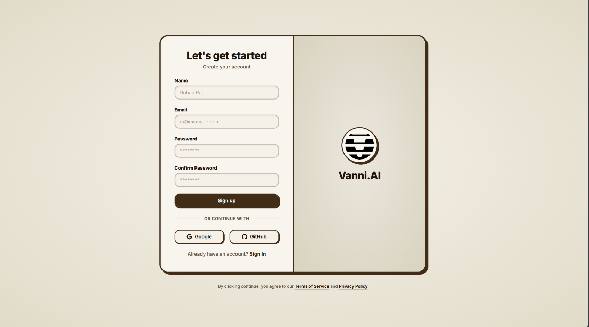 |
| **Dashboard** | 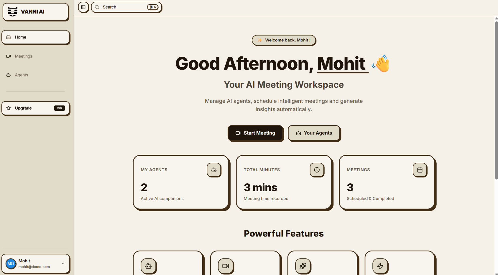 |
| **Agent Creation** | 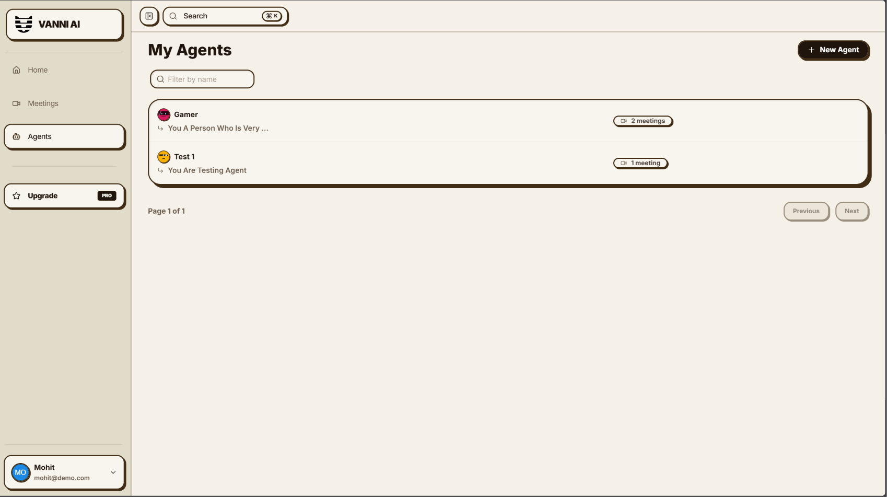 |
| **Agent Details** | 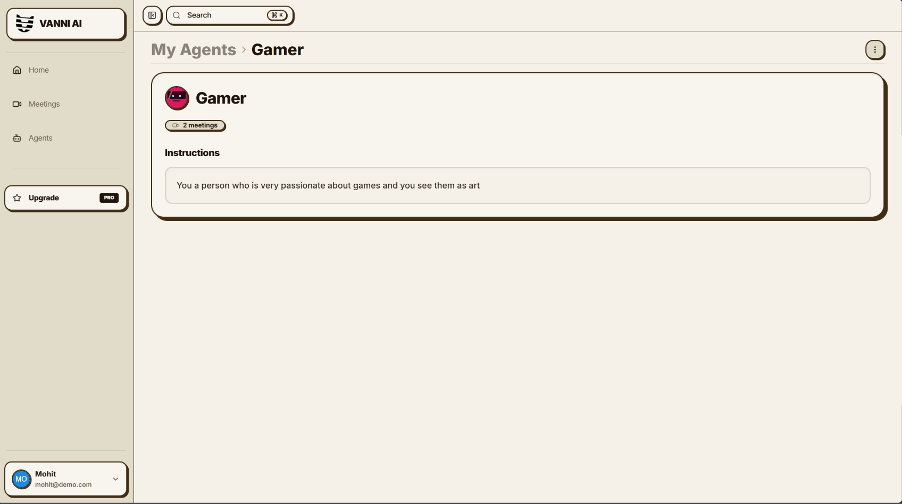 |
| **Meeting Page** | 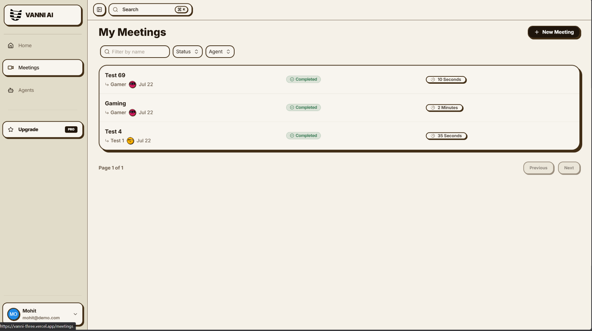 |
| **Call Screen** | 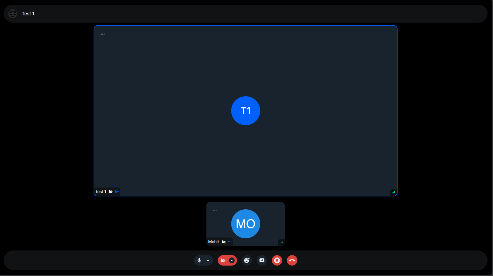 |
| **Transcript View** | 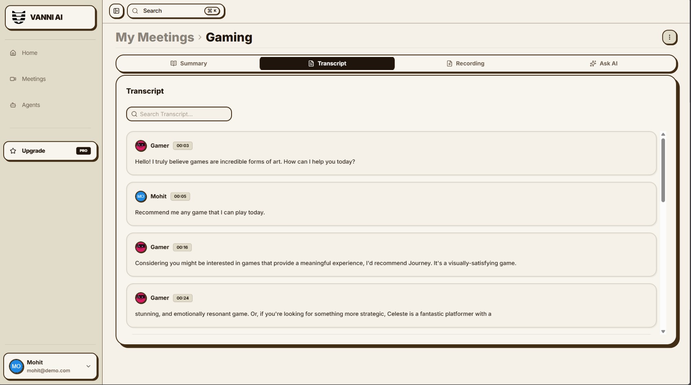 |
| **Summary View** | 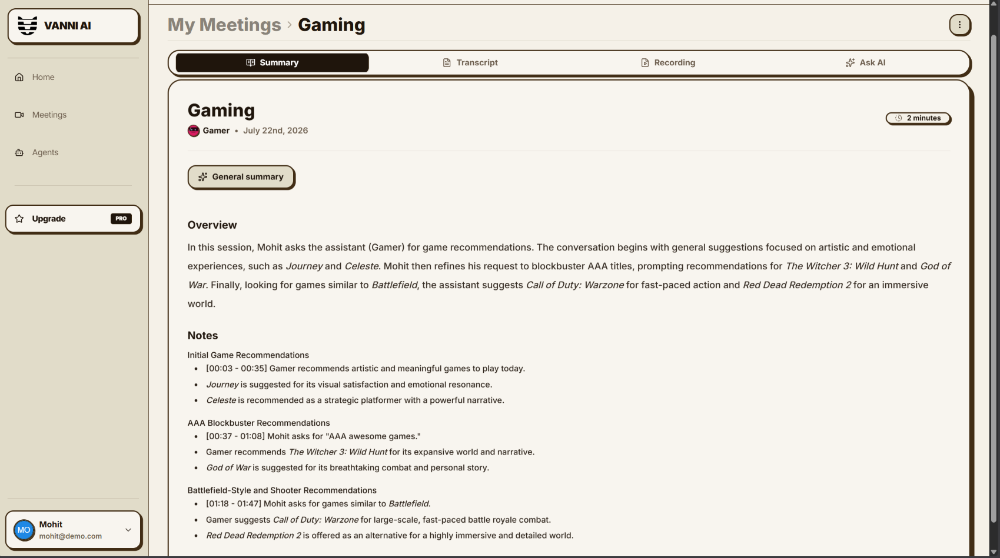 |
| **Ask AI Chat** | 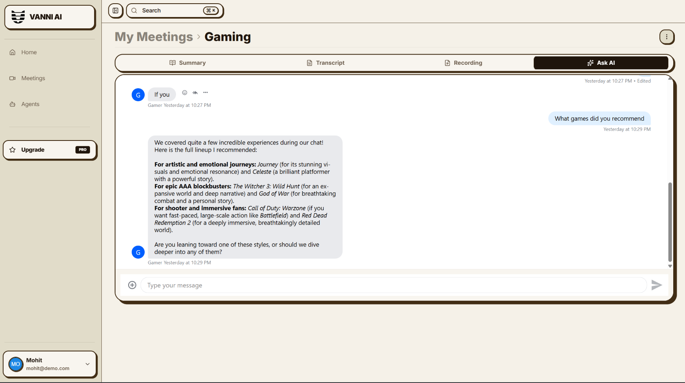 |
| **Pricing Tiers** | 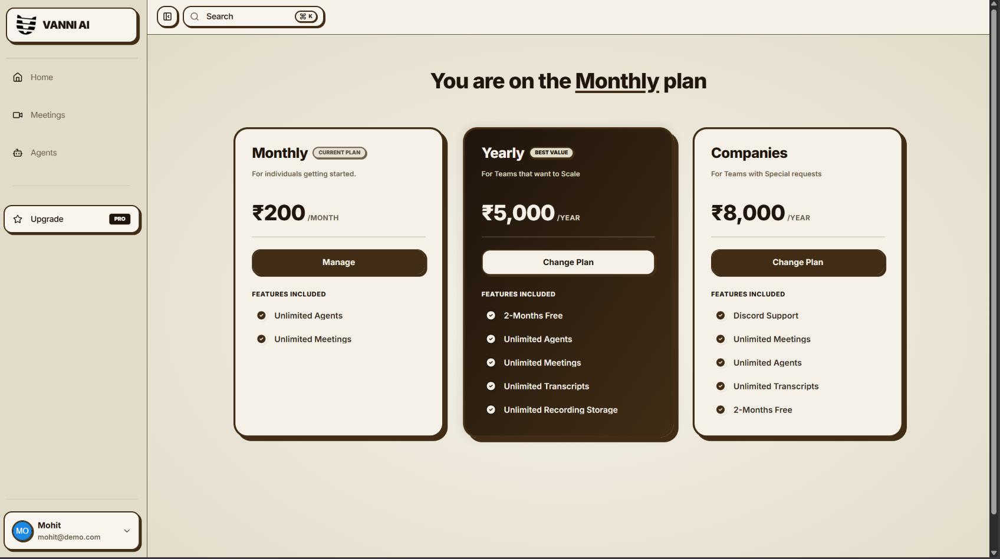 |

</details>

---

## ✨ Features

- **🔐 Authentication**: GitHub OAuth via Better Auth with secure session cookies.
- **🎙️ Real-time Voice AI**: Automated AI room entry & sub-second voice chat using Gemini Live & Stream SDK.
- **📝 Transcripts & Summaries**: Diarized speaker transcripts & automated AI executive summaries via Inngest queues.
- **💬 Ask AI**: Interactive post-meeting Q&A over transcript context.
- **🤖 Agent Management**: Create custom AI agents with tailored prompts and personalities.
- **💳 Premium Subscriptions**: Tier enforcement (agents & meeting limits) via Polar integration.
- **🎨 Modern UI**: Custom Claymorphic design with responsive layout & smooth micro-interactions.

---

## 🛠️ Tech Stack

| Category | Technology | Description |
| :--- | :--- | :--- |
| **Frontend** | Next.js 15, React 19, Tailwind CSS v4 | App Router, Server Components & Claymorphism UI |
| **Backend & API** | tRPC v11, Zod | Type-safe RPC router and payload validation |
| **Database** | Neon PostgreSQL, Drizzle ORM | Serverless Postgres database with type-safe schema |
| **Auth** | Better Auth | OAuth session handling & route middleware |
| **Real-time Media**| Stream Video & Chat SDK | WebRTC video/audio streaming infrastructure |
| **AI Engine** | Gemini Live & Gemini 2.5 | Real-time bi-directional audio & transcript summarization |
| **Background Jobs**| Inngest | Async event queue for transcripts & summary generation |
| **Agent Worker** | Python FastAPI, Uvicorn | WebRTC audio bridge to Gemini Live on Railway |
| **Payments** | Polar.sh | Developer-first subscription & entitlements manager |
| **Hosting** | Vercel & Railway | Next.js hosted on Vercel; Python worker hosted on Railway |

---

## 🏗️ System Architecture

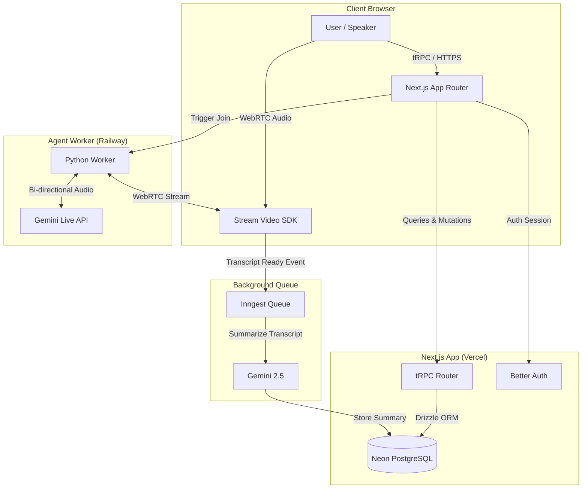

---

## 📁 Project Structure

```
vanni/
├── agent-worker/          # Python FastAPI service for Gemini Live audio streaming
├── public/                # Static brand assets and icons
├── screenshots/           # Application screenshots showcase
├── src/
│   ├── app/               # Next.js App Router (pages & API routes)
│   ├── components/        # UI components & Claymorphism primitives
│   ├── db/                # Drizzle schema & Neon PostgreSQL connection
│   ├── inngest/           # Async background job processing functions
│   ├── lib/               # Utility functions & SDK instances
│   ├── modules/           # Feature modules (agents, auth, call, dashboard, meetings, premium)
│   └── trpc/              # Type-safe API routers & procedure definitions
├── .env.example           # Environment variables template
├── drizzle.config.ts      # Drizzle ORM configuration
└── package.json           # Project dependencies & scripts
```

---

## 💡 Key Features

- **AI Agents**: Custom AI personas with targeted system instructions that join live video meetings automatically.
- **Voice Conversations**: Low-latency spoken audio streaming between Stream Video WebRTC channels and Gemini Live.
- **Speaker Transcripts**: Automatic speaker diarization providing timestamped transcripts post-call.
- **Meeting Summaries**: Asynchronous Inngest background jobs generating structured bullet points and action items.
- **Ask AI Drawer**: Interactive RAG assistant enabling users to ask follow-up questions about completed meeting transcripts.
- **Premium Subscriptions**: Usage limit management powered by Polar to restrict agent creation and meeting duration by tier.

---

## 🚀 Future Improvements

- [ ] **Google Calendar Integration**: Automatically invite AI agents to upcoming calendar events.
- [ ] **Multi-Model Selector**: Support for OpenAI Realtime API and Anthropic Claude for transcript analysis.
- [ ] **Team Workspaces**: Shared archives for team-wide meeting notes and search.
- [ ] **Meeting Analytics**: Visual charts for speaker talk-time distribution and sentiment tracking.
- [ ] **One-Click Export**: Export summaries directly to Notion, Slack, and PDF.

---

## 🤝 Contributing

Contributions are welcome!

1. Fork the project
2. Create your feature branch (`git checkout -b feature/AmazingFeature`)
3. Commit your changes (`git commit -m 'Add AmazingFeature'`)
4. Push to the branch (`git push origin feature/AmazingFeature`)
5. Open a Pull Request

---

## 📄 License

Distributed under the **MIT License**.

---

## 👨‍💻 Author & Contact

**Mohit Jaiswal**  
*Undergraduate Computer Science Student*

- **GitHub**: [@MohitJaiswal2507](https://github.com/MohitJaiswal2507)
- **Email**: [mohitjasiwal2507@gmail.com](mailto:mohitjasiwal2507@gmail.com)

---

## 🙏 Acknowledgements

- [Next.js](https://nextjs.org/)
- [Stream Video & Chat](https://getstream.io/)
- [Google Gemini API](https://ai.google.dev/)
- [Inngest](https://www.inngest.com/)
- [Neon DB](https://neon.tech/) & [Drizzle ORM](https://orm.drizzle.team/)
- [Better Auth](https://www.better-auth.com/)
- [Polar.sh](https://polar.sh/)
